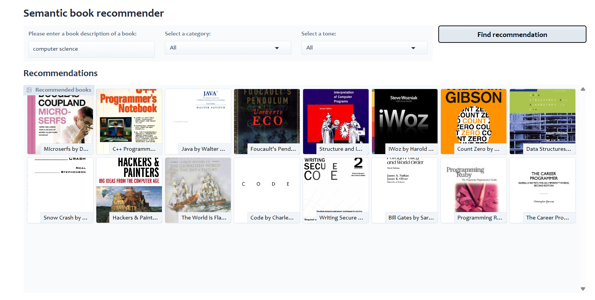

# 📚 Semantic Book Recommendation with LLMs

A smart book recommendation system that understands the **semantic meaning** and **emotional context** of your input using Large Language Models (LLMs).



---

## 🔧 Getting Started

### 📦 Prerequisites

- Python 3.8+
- pip (Python package manager)

### ⚙️ Installation

1. **Clone the repository**

```bash
git clone git@github.com:deeppatel1842/book_recommendation_LLM.git
cd book_recommendation_LLM
```

2. **Install dependencies**

```bash
pip install -r requirements.txt
```

---

## 💡 Features

- Semantic understanding of book descriptions  
- Emotion-aware recommendations  
- Interactive Gradio interface  

---

## 🧠 Technical Architecture

### 🔍 Core Components

- **Semantic Search**:  
  Uses `sentence-transformers/all-MiniLM-L6-v2` for generating text embeddings.

- **Sentiment Analysis**:  
  Uses `j-hartmann/emotion-english-distilroberta-base` for extracting emotional context.

### 🔄 Data Flow

1. User input processing  
2. Embedding generation  
3. Similarity matching  
4. Emotion-based filtering  
5. Final recommendation generation  

---

## 🚀 Usage

### ▶️ Running the Application

```bash
python gradio_dashboard.py
```
